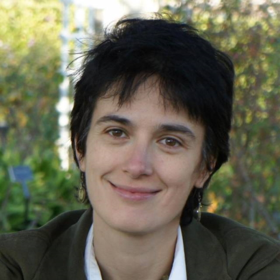

# Invited Speakers

## Professor Mihaela van der Schaar

#### Biography:
Mihaela van der Schaar is the John Humphrey Plummer Professor of Machine Learning, Artificial Intelligence and Medicine at the University of Cambridge and a Fellow at The Alan Turing Institute in London. In addition to leading the van der Schaar Lab, Mihaela is founder and director of the Cambridge Centre for AI in Medicine (CCAIM).
Mihaela was elected IEEE Fellow in 2009. She has received numerous awards, including the Oon Prize on Preventative Medicine from the University of Cambridge (2018), a National Science Foundation CAREER Award (2004), 3 IBM Faculty Awards, the IBM Exploratory Stream Analytics Innovation Award, the Philips Make a Difference Award and several best paper awards, including the IEEE Darlington Award.
Mihaela is personally credited as inventor on 35 USA patents, many of which are still frequently cited and adopted in standards. She has made over 45 contributions to international standards for which she received 3 ISO Awards.

## Professor Laure Zanna

#### Biography:
Laure Zanna is a Professor in Mathematics & Atmosphere/Ocean Science at the Courant Institute, New York University. Her research focuses on the dynamics of the climate system and the main emphasis of her work is to study the influence of the ocean on local and global scales. Prior to NYU, she was a faculty member at the University of Oxford until 2019, and obtained her PhD in 2009 in Climate Dynamics from Harvard University. She was the recipient of the 2020 Nicholas P. Fofonoff Award from the American Meteorological Society “For exceptional creativity in the development and application of new concepts in ocean and climate dynamics”. She is the lead principal investigator of the NSF-NOAA Climate Process Team on Ocean Transport and Eddy Energy, and M2LInES – an international effort to improve climate models with scientific machine learning. She currently serves as an editor for the Journal of Climate, a member on the International CLIVAR Ocean Model Development Panel, and on the CESM Advisory Board.

## Professor Eric J. Tchetgen Tchetgen

#### Biography:
Eric J. Tchetgen Tchetgen is the Luddy Family President’s Distinguished Professor at the Wharton School of the University of Pennsylvania.
Professor Tchetgen Tchetgen comes to the University of Pennsylvania from Harvard University, where he has served since 2008 as Professor of Biostatistics and Epidemiologic Methods with joint appointments in the departments of Biostatistics and Epidemiology at the T.H. Chan School of Public Health.
He researches infectious diseases, including HIV/AIDS, and the role of genetic and social factors in the patterns, causes, and effects of public health. Professor Tchetgen Tchetgen has received grants from the National Institutes of Health and the Centers for Disease Control.
He completed his Ph.D. in Biostatistics at Harvard University in 2006 under the supervision of Professor James M. Robins. He received his B.S. in Electrical Engineering from Yale University in 1999.
